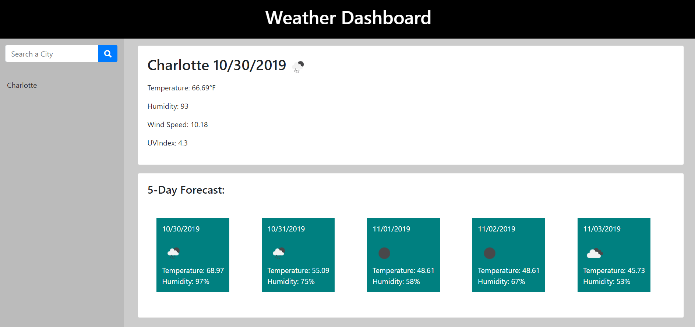

# Weather Dashboard

This repo is for the UNCC coding bootcamp

## Instructions

Create a webpage that calls the open weather api and use it to display weather information of the city the user searches for

## Screenshot

   

### Links

[Github Repo](https://github.com/adam-lowe/HW6-Weather-Dashboard)

[Completed Work](https://adam-lowe.github.io/HW6-Weather-Dashboard)